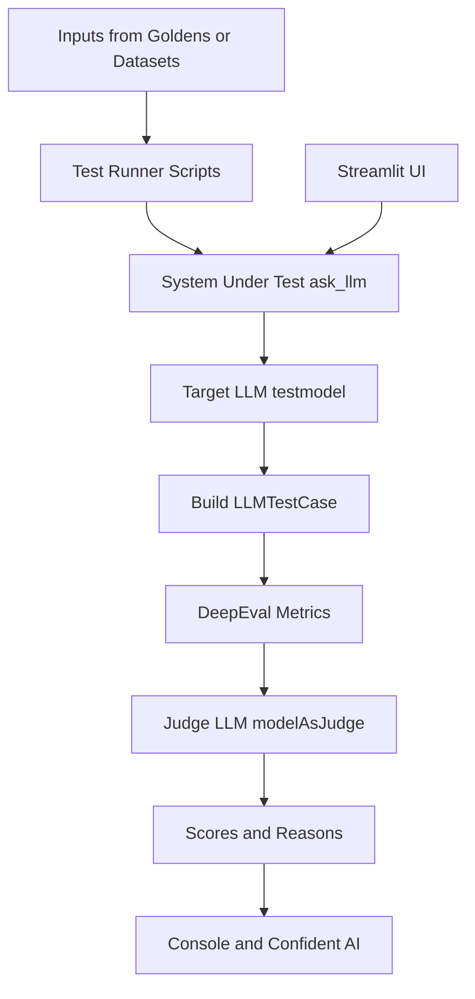

# AI Engineering Evaluation (Python)

This repository evaluates LLM responses with DeepEval while using a Streamlit chatbot as the system under test.

## What this project does

- Runs a chatbot app and calls an OpenAI-compatible endpoint via LangChain.
- Builds DeepEval test cases from local Goldens or dataset files.
- Scores outputs with two metrics:
   - AnswerRelevancyMetric
   - FaithfulnessMetric
- Uses a separate LLM-as-Judge implementation for deterministic grading.

## Repository map

| Path | Purpose |
|---|---|
| chatbot.py | Streamlit chatbot UI and reusable ask_llm() function |
| ChatHistory.json | Persistent chat history created at runtime (not tracked in Git) |
| test/LLMModeAsJudge.py | Custom DeepEval model wrapper used as LLM-as-Judge |
| test/multipleMetricTest.py | Evaluates locally defined Golden test cases |
| test/pullingDatasetLLMTest.py | Pulls a dataset from Confident AI and evaluates it |
| test/usingDevDataset.py | Builds a dataset from dev.json and evaluates sample cases |
| test/conftest.py | pytest bootstrap and root import path setup |
| dev.json | Local QA-style dataset source |
| execution.md | Architecture/workflow reference |

## Architecture



Plain text fallback:

```text
Inputs (local Goldens / pulled dataset / dev.json)
   -> Test runner scripts
   -> ask_llm() in chatbot.py
   -> Target LLM (testmodel)
   -> LLMTestCase
   -> DeepEval metrics
   -> Judge LLM (modelAsJudge)
   -> Scores and reasons
   -> Console + optional Confident AI tracking

Streamlit UI
   -> ask_llm() in chatbot.py
```

## Evaluation flow

1. A question is provided from local Goldens, pulled dataset entries, or dev.json-derived entries.
2. The system under test calls ask_llm() from chatbot.py to get actual_output.
3. A LLMTestCase is created with input, actual_output, expected_output, and retrieval_context.
4. DeepEval runs metrics using the judge model from test/LLMModeAsJudge.py.
5. Results are printed and can be tracked in Confident AI.

## Prerequisites

- Python 3.10+
- A valid API key for your OpenAI-compatible provider
- Model names for:
   - the chatbot model
   - the judge model
- Optional: Confident AI API key if using hosted dataset workflows

## Setup

1. Create and activate a virtual environment.

```powershell
python -m venv ai-env
.\ai-env\Scripts\Activate.ps1
```

2. Install required packages.

```powershell
pip install streamlit deepeval python-dotenv langchain-openai pytest
```

3. Create a .env file in the repository root.

```env
grok_api_key=your_provider_api_key
base_url=your_openai_compatible_base_url
testmodel=your_chatbot_model_name
modelAsJudge=your_judge_model_name
confident-api-key=your_confident_ai_api_key
```

Notes:
- Keep base_url and model names compatible with your provider.
- If confident-api-key is not used, avoid dataset pull/push flows that depend on Confident AI.

## Run the chatbot

```powershell
streamlit run chatbot.py
```

Default URL: http://localhost:8501

## Run evaluations

Run from the repository root.

```powershell
pytest test/multipleMetricTest.py
pytest test/pullingDatasetLLMTest.py
pytest test/usingDevDataset.py
```

## Common troubleshooting

- Import error for judge model:
   - Confirm test/LLMModeAsJudge.py exists and is importable from tests.
- Empty actual_output in DeepEval:
   - Ensure your model credentials and base_url are valid.
   - Validate chatbot ask_llm() returns non-empty text.
- Provider connectivity failures:
   - Recheck .env values and model names.

## Notes on current test behavior

- test/usingDevDataset.py currently evaluates only the first 2 Goldens from dev.json for demonstration.
- Dataset push in test/multipleMetricTest.py is present but commented.

## License

No license file is currently defined in this repository.
