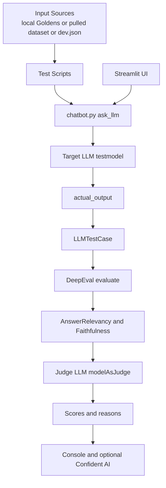

# Execution Architecture

This file documents how prompts flow from dataset inputs through the chatbot and into DeepEval scoring.

## High-Level Flow



## Plain-Text Fallback

```text
Input sources (local Goldens, pulled dataset, or dev.json)
      -> test scripts
      -> ask_llm() in chatbot.py
      -> target LLM (testmodel)
      -> actual_output
      -> LLMTestCase
      -> DeepEval evaluate()
      -> metrics (AnswerRelevancy, Faithfulness)
      -> judge LLM (modelAsJudge)
      -> scores and reasons
      -> console + optional Confident AI tracking

Streamlit UI
      -> ask_llm() in chatbot.py
```

## Script Roles

- test/multipleMetricTest.py: Defines local Goldens and evaluates responses.
- test/pullingDatasetLLMTest.py: Pulls dataset from Confident AI and evaluates.
- test/usingDevDataset.py: Builds Golden data from dev.json and evaluates sample rows.
- test/LLMModeAsJudge.py: Provides the DeepEval LLM-as-Judge wrapper.
- chatbot.py: System under test and Streamlit chat interface.